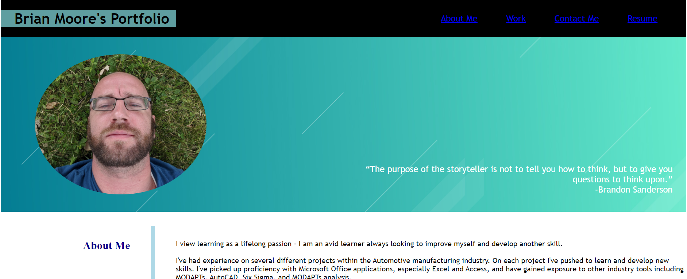

# Development-Portfolio
Edit 3/4/21: Welcome to my portfolio page!  I've learned a lot these past few weeks, and I'll be updating this portfolio soon.  I'll be implementing javascript to add functionality, and displaying a few new projects in the 'Work' section.  On top of that, I'm planning and entire page overhaul using the Bootstrap, mobile-first CSS framework!
I hope you'll enjoy the changes!

In the meantime, feel free to check out some of the other projects' live pages:  
Daily Planner: https://bborumoore.github.io/daily-planner/  
Weather Dashboard: https://bborumoore.github.io/weather-dashboard/ (to be deployed in it's full state by 3/6/21)  
*COMING SOON* A Mars Daily Widget!  - I'm working collaboratively with a team that will bring you daily insights *from Mars*. I hope you're as excited as I am!  

A Portfolio of my personal web development projects
This site features a couple of techniques that I recently learned to use.  The entire site is coded using only HTML and CSS.

Featured techniques:  
-Used Absolute/Relative positioning to overlay text and images onto images  
-Extensive use of Flexbox to make the site more responsive  
-Creative use of anchor tags to make icons and images double as links  
-New use of anchor tags (for me) to have icons prompt users to send emails or make a phone call or text message   
  
  Here is a link for the deployed application: https://bborumoore.github.io/Portfolio/  
  And a screenshot so that you know what you're getting into!  
  
    
